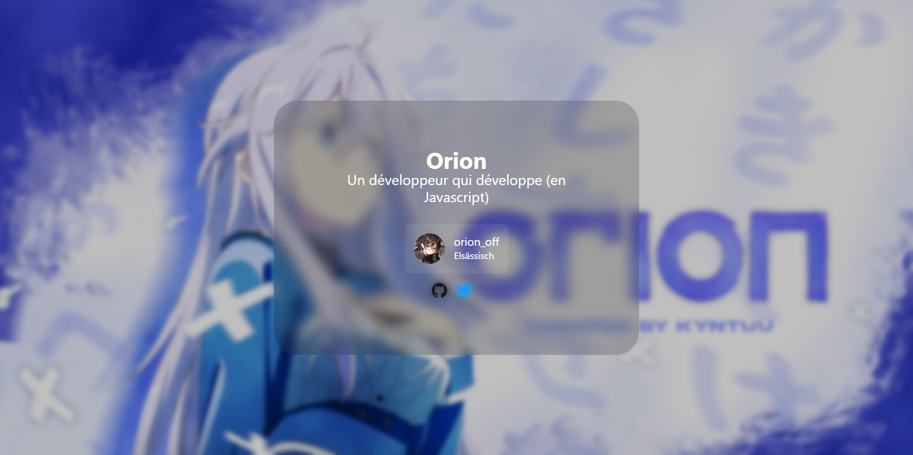
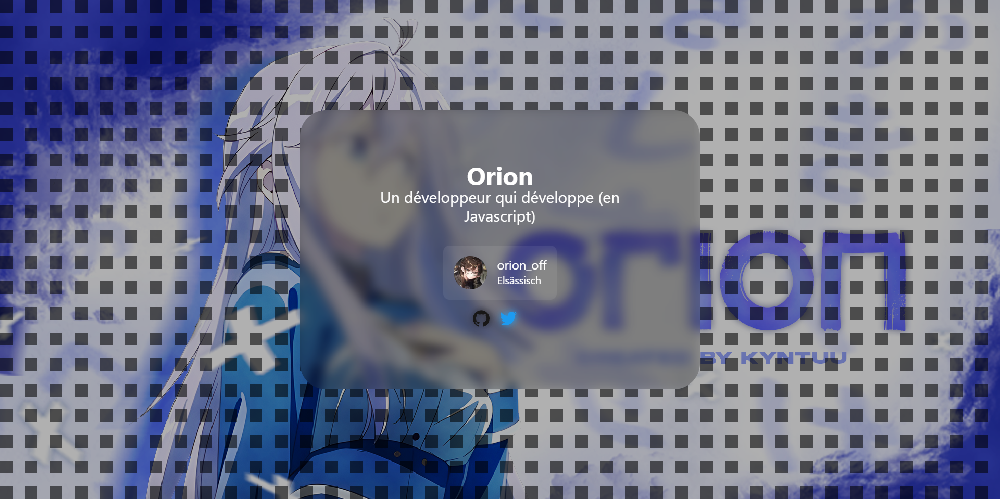
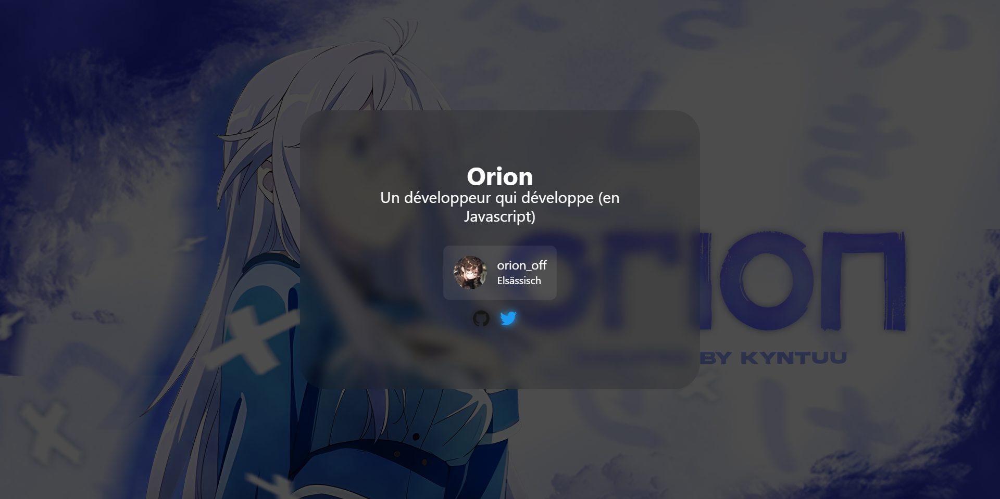

# Make your Leonis
## Requirements
!!! npm "Node Package Manager"
    The builder is available on [npmjs.com :octicons-link-external-24:](https://www.npmjs.com/package/){target='_blank'} named `@leonis/builder`.

For configure your Leonis, you need to have installed:
<div class="grid cards" markdown>
-   :fontawesome-brands-node-js:{ .lg .middle } __Node JS__

    ---

    You need to install NodeJS.

    [:octicons-arrow-right-24: Install](https://nodejs.org/en/download)

-   :octicons-command-palette-24:{ .lg .middle } __Builder__

    ---

    You need to install the Leonis Builder.

    ```
    npm install -g @leonis/builder
    ```
</div>
## Configure
For configure your Leonis, you need to create a `config.yml` or any other file with the same extension.
### Required fields
A leonis config file must have the following fields:

-   `name`: Your username
-   `description`: A little description about you
-   `background`: The background image of your page (For the path, see [here](#file-paths))
### File paths
For multiple fields, you have to specify the path of the file.
To specify the path of the file, you need to make a folder named `resources`.
And inside the folder, you need to put the files.

After, in the field, you need to put the name of the file.

### Effects
You can add effects to your page. There are effects for the background, your name, and your description.

!!! note
    All the fields are optional.

In the config file, this is the syntax:
```yaml
effects:
  background:
  name:
  description:
```
#### Background
The effects for the background are:

<div class="grid cards" markdown>

-   `blurred`: The background is blurred.

    ---

    

-   `old_tv`: The background is like an old TV.

    ---

    

-   `night_time`: The background is darken.
    
    ---

    

</div>

#### Name
The effects for the name are:

<div class="grid cards" markdown>

-   `rainbow`: The name is like a rainbow.

    ---

    

-   `flash`: The name is flashing.

    ---

    

</div>

#### Description
The effects for the description are:

<div class="grid cards" markdown>

-   `typewriter`: The description is like a typewriter.
    
    ---

    
</div>